# Ejercicio-7-Improve-Banking-Processor-Design
## Problem 4: Multi-Identity Banking with Processors

### Diseño mejorado con herencia y polimorfismo

Este rediseño se basa en cinco ideas:

1. **Cada identidad define su propio comportamiento.**  
   `Identity` se convierte en una clase abstracta con las reglas comunes y cada tipo de identidad (`PersonalIdentity`, `BusinessIdentity`, `MinorIdentity` y `ForeignResidentIdentity`) sobrescribe las operaciones permitidas, las validaciones y el límite diario. De esta manera, `BankingService` no necesita preguntar qué tipo de identidad está procesando.

2. **Cada operación tiene solamente los datos que necesita.**  
   `BankOperation` se convierte en una clase abstracta y se crean `Deposit`, `Withdrawal`, `DomesticTransfer`, `InternationalTransfer` y `Payroll`. Así, una operación internacional puede tener BIC y moneda sin obligar a un depósito a tener esos campos.

3. **Los procesadores externos se adaptan mediante wrappers.**  
   Los procesadores bancarios no se modifican porque representan APIs de entidades externas. Se crea un contrato común `Processor` y un wrapper para cada procesador. Cada wrapper traduce `process(Identity, BankOperation)` hacia la API específica del procesador correspondiente.

4. **Las restricciones entre identidad y procesador se separan de ambas clases.**  
   La regla de que un menor solamente puede utilizar National Bank no pertenece directamente al procesador ni necesita que `MinorIdentity` conozca las clases concretas de los bancos. `ProcessorPolicy` se encarga de validar esta relación.

5. **`BankingService` coordina el flujo sin conocer los detalles.**  
   `BankingService` trabaja con las abstracciones `Identity`, `BankOperation` y `Processor`. De esta manera, una nueva identidad o un nuevo procesador se puede agregar mediante una nueva clase sin agregar nuevos `case` al servicio.

### Diagrama de clases

```mermaid
classDiagram

    class User {
        -String id
        -String fullName
        -List~Identity~ identities
        +addIdentity(Identity)
        +findIdentity(...)
    }

    class Identity {
        <<abstract>>
        -String documentNumber
        -String accountNumber
        +isOperationAllowed(BankOperation) boolean
        +validate(BankOperation, LocalDate) String
        +dailyLimit() double
        +getAccountNumber() String
    }

    class PersonalIdentity {
        +isOperationAllowed(BankOperation) boolean
        +validate(BankOperation, LocalDate) String
        +dailyLimit() double
    }

    class BusinessIdentity {
        -String companyName
        +isOperationAllowed(BankOperation) boolean
        +validate(BankOperation, LocalDate) String
        +dailyLimit() double
    }

    class MinorIdentity {
        -String guardianUserId
        +isOperationAllowed(BankOperation) boolean
        +validate(BankOperation, LocalDate) String
        +dailyLimit() double
    }

    class ForeignResidentIdentity {
        -String countryCode
        -LocalDate residencyExpiresOn
        +isOperationAllowed(BankOperation) boolean
        +validate(BankOperation, LocalDate) String
        +dailyLimit() double
    }

    class BankOperation {
        <<abstract>>
        -double amount
        +totalAmount() double
        +validate() String
        +getAmount() double
    }

    class Deposit {
        +totalAmount() double
        +validate() String
    }

    class Withdrawal {
        +totalAmount() double
        +validate() String
    }

    class DomesticTransfer {
        -String destinationAccount
        +totalAmount() double
        +validate() String
    }

    class InternationalTransfer {
        -String destinationAccount
        -String destinationBic
        -String currency
        +totalAmount() double
        +validate() String
    }

    class Payroll {
        -List~String~ payrollAccounts
        +totalAmount() double
        +validate() String
    }

    class Processor {
        <<interface>>
        +process(Identity, BankOperation) ProcessorResult
        +supports(BankOperation) boolean
    }

    class ProcessorResult {
        -boolean success
        -String reference
        -double fee
        -String message
        +success(String, double) ProcessorResult
        +failure(String) ProcessorResult
    }

    class NationalBankWrapper {
        -NationalBankProcessor processor
        +process(Identity, BankOperation) ProcessorResult
        +supports(BankOperation) boolean
    }

    class PacificBankWrapper {
        -PacificBankProcessor processor
        +process(Identity, BankOperation) ProcessorResult
        +supports(BankOperation) boolean
    }

    class SwiftGatewayWrapper {
        -SwiftGatewayProcessor processor
        +process(Identity, BankOperation) ProcessorResult
        +supports(BankOperation) boolean
    }

    class NationalBankProcessor {
        +postTransaction(String, String, double, String) String
    }

    class PacificBankProcessor {
        +submit(String, String, long, String) String
        +submitPayroll(String, List~String~, long) String
    }

    class SwiftGatewayProcessor {
        +sendWire(String, String, String, double, String) String
    }

    class ProcessorPolicy {
        +isAllowed(Identity, Processor) boolean
    }

    class DailyUsageTracker {
        +usedOn(Identity, LocalDate) double
        +record(Identity, LocalDate, double)
    }

    class AuditLog {
        +record(String)
    }

    class OperationResult {
        -boolean success
        -String reference
        -double fee
        -String message
    }

    class BankingService {
        -DailyUsageTracker usageTracker
        -AuditLog auditLog
        -ProcessorPolicy processorPolicy
        +execute(User, Identity, BankOperation, Processor, LocalDate) OperationResult
    }


    Identity <|-- PersonalIdentity
    Identity <|-- BusinessIdentity
    Identity <|-- MinorIdentity
    Identity <|-- ForeignResidentIdentity

    BankOperation <|-- Deposit
    BankOperation <|-- Withdrawal
    BankOperation <|-- DomesticTransfer
    BankOperation <|-- InternationalTransfer
    BankOperation <|-- Payroll

    Processor <|.. NationalBankWrapper
    Processor <|.. PacificBankWrapper
    Processor <|.. SwiftGatewayWrapper

    NationalBankWrapper *-- NationalBankProcessor
    PacificBankWrapper *-- PacificBankProcessor
    SwiftGatewayWrapper *-- SwiftGatewayProcessor

    User "1" *-- "1..*" Identity

    BankingService --> User
    BankingService --> Identity
    BankingService --> BankOperation
    BankingService --> Processor
    BankingService --> ProcessorPolicy
    BankingService --> DailyUsageTracker
    BankingService --> AuditLog
    BankingService --> OperationResult

    Processor --> ProcessorResult

    ProcessorPolicy --> Identity
    ProcessorPolicy --> Processor

    NationalBankWrapper --> NationalBankProcessor : process() wraps postTransaction()
    PacificBankWrapper --> PacificBankProcessor : process() wraps submit()
    PacificBankWrapper --> PacificBankProcessor : process() wraps submitPayroll()
    SwiftGatewayWrapper --> SwiftGatewayProcessor : process() wraps sendWire()
```



## ¿Qué cambió?

| Solicitud de cambio | Primer diseño | Diseño mejorado |
|---------------------|---------------|-----------------|
| Nueva identidad | Modificar varios métodos de `BankingService` | Agregar una nueva subclase de `Identity` |
| Reglas de identidad | `BankingService` usa `switch` según el tipo | Cada identidad define sus propias reglas |
| Límite diario | `dailyLimit()` depende del tipo de identidad | `dailyLimit()` es polimórfico |
| Nueva operación | Agregar campos y condiciones a `BankOperation` | Agregar una nueva subclase de `BankOperation` |
| Nuevo procesador | Modificar soporte, comisión y despacho | Agregar un nuevo wrapper |
| API de los bancos | `BankingService` conoce los métodos específicos | Cada wrapper adapta la API externa |
| Errores de los procesadores | `BankingService` conoce las diferentes formas de error | Cada wrapper devuelve `ProcessorResult` |
| Menores y procesadores | Regla dentro de `BankingService` | `ProcessorPolicy` controla la compatibilidad |
| `BankingService` | Contiene múltiples reglas y `switch` | Coordina llamadas a colaboradores |

## Polimorfismo

El polimorfismo permite que `BankingService` utilice una referencia de tipo `Identity` sin conocer cuál de sus subclases está utilizando.
Ejemplo:

```java
Identity identity = user.findIdentity(identityType);

boolean allowed = identity.isOperationAllowed(operation);
String problem = identity.validate(operation, today);
double limit = identity.dailyLimit();
```

La misma llamada puede ejecutar el comportamiento de `PersonalIdentity`, `BusinessIdentity`, `MinorIdentity` o `ForeignResidentIdentity`, dependiendo del objeto que reciba la llamada.

## Wrapping de los procesadores

Los procesadores externos no se modifican porque pertenecen a entidades bancarias diferentes y tienen APIs distintas.

Por ejemplo, `BankingService` utiliza un método unificado:

```java
ProcessorResult result = processor.process(identity, operation);
```

El `NationalBankWrapper` traduce esa llamada al método que ya existe en el procesador externo:

```java
return nationalBank.postTransaction(
    accountNumber,
    kind,
    amount,
    counterparty
);
```

De esta forma, `BankingService` utiliza siempre `process(...)`, mientras que cada wrapper se encarga de acceder al método específico de su procesador.
    
